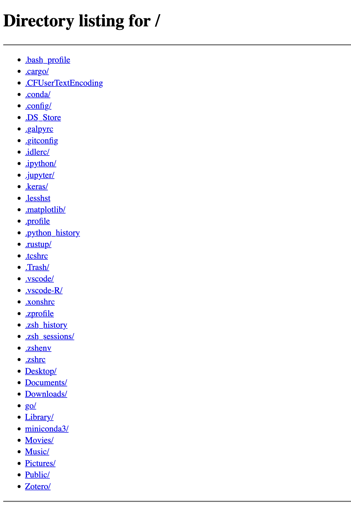

# My Serveur

Serveur FTP personnalisé et basé sur le serveur `http.server` de Python.

Le script se lance normalement :

```bash
python serveur.py
```

ou en spécifiant le chemin d'accès comme argument :

```bash
python serveur.py <where-to-start-the-server>
```

Le script va se charger de déterminer l'adresse IP locale de l'ordinateur, et va lancer la commande :

```bash
python3 -m http.server <port> --bind <ip-address>
```

Par défaut le serveur se lance dans le dossier 'Home'.
À noter ici : si vous lancez le script via Windows, il faudra pour l'instant modifier la variable `commande` et écrire `python` au lieu de `python3`. De plus, il est possible de changer le port si nécessaire. Le port 9999 est utilisé par défaut.

Une fois le script lancé, n'importe quel appareil se rendant dans un navigateur à l'adresse/url `http://<ip-address>:<PORT>` pourra accéder aux fichiers de l'ordinateur lançant le script. Cela devrait ressembler à ceci :


